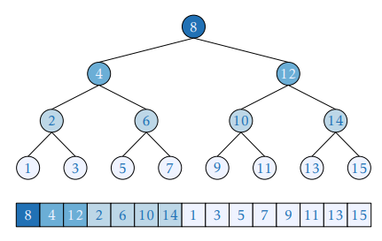

# Eytzinger Binary Search

This tutorial is loosely based on a [46-page paper](https://arxiv.org/pdf/1509.05053.pdf) by Paul-Virak Khuong and Pat Morin "Array layouts for comparison-based searching" and describes one particular way of performing efficient binary search by rearranging elements of a sorted array in a cache-friendly way.

We briefly review relevant concepts in processor architecture; if you want to get deeper, we recommend reading the original 2015 paper, as well as these articles:

* [Modern Microprocessors: a 90-minute guide](http://www.lighterra.com/papers/modernmicroprocessors/) by Jason Patterson

* [Cache-Oblivious Algorithms and Data Structures](https://erikdemaine.org/papers/BRICS2002/paper.pdf) by Erik Demaine

* [What Every Programmer Should Know About Memory](https://people.freebsd.org/~lstewart/articles/cpumemory.pdf) by Ulrich Drepper

Our minimalistic implementation is only ~15 lines of code while offering 4-5x speedup over `std::lower_bound`.

**If you are writing a contest right now**, stuck on a problem where binary search is a bottleneck, and suddenly remembered about this article, **jump straight to "complete implementation"**, it's compilable and copy-pastable.

## Why is binary search slow?

Here is a standard way of searching for the first element not less than $x$ in a sorted array:

```cpp
int lower_bound(int x) {
    int l = 0, r = n - 1;
    while (l < r) {
        int t = (l + r) / 2;
        if (a[t] >= x)
            r = t;
        else
            l = t + 1;
    }
    return a[l];
}
```

The running time of this (or any) algorithm is not just the "cost" of all its arithmetic operations, but rather this cost *plus* the time spent waiting for data to be fetched from memory. Thus, depending on the algorithm and problem limitations, it can be CPU-bound or memory-bound, meaning that the running time is dominated by one of its components.

If array is large enough—usually around the point where it stops fitting in cache and fetches become significantly slower—the running time of binary search becomes dominated by memory fetches.

To give an idea, the following code is only ~5% slower for $n \approx 10^6$:

```cpp
int slightly_slower_lower_bound(int x) {
    int l = 0, r = n - 1;
    while (l < r) {
        volatile int s = 0; // volatile to prevent compiler from cutting this code out
        for (int i = 0; i < 10; i++)
            s += i;
        int t = (l + r) / 2;
        if (a[t] >= x)
            r = t;
        else
            l = t + 1;
    }
    return a[l];
}
```

To be more precise about it, we briefly explain how memory fetching works.

## How caching works

Here is a famous quote about caching:


The reality is much more complicated, e. g. main memory has pagination and HDD is actually a rotating physical thing with weird access patterns, but we stick to this analogy and introduce some important entities to it:

* **Cache hierarchy** is a memory architecture which uses a hierarchy of memory stores based on varying access speeds to cache data. Adjacent cache layers usually differ in size by a factor of 8 to 10 and in latency by a factor of 3 to 5. Most modern CPUs have 3 layers of cache (called L1, L2 and L3 from fastest / smallest to slowest / largest) with largest being a few megabytes large.

* **Cache line** is the unit of data transfer between CPU and main memory. The cache line of your PC is most likely 64 bytes, meaning that the main memory is divided into blocks of 64 bytes, and whenever you request a byte, you are also fetching its cache line neighbours regardless whether your want it or not. *Fetching a cache line is like grabbing a 6-pack.*

* **Eviction policy** is the method for deciding which data to retain in the cache. In CPUs, it is controlled by hardware, not software. For simplicity, programmer can assume that **least recently used (LRU)** policy is used, which just evicts the item that hasn't been used for the longest amount of time. *This is like preferring beer with later expiration dates.*

* **Bandwidth** is the rate at which data can be read or stored. For the purpose of designing algorithms, a more important characteristic is the **bandwidth-latency product** which basically tells how many cache lines you can request while waiting for the first one without queueing up. It is around 5 or more on most systems. *This is like having friends whom you can send for beers asynchronously.*

* **Temporal locality** is an access pattern where if at one point a particular item is requested, it is likely that this same location will be requested again in the near future. *This is like fetching the same type of beer over and over again.*

* **Spacial locality** is an access pattern where if a memory location is requested, it is likely that a nearby memory locations will be requested again in the near future. *This is like storing the kinds of beer that you like on the same shelf.*

The main problem with binary search over a sorted array is that its memory accesses pattern is neither temporary nor spacially local. For example, element $\lfloor \frac n 2 \rfloor$ is accessed very often (each search) and element $\lfloor \frac n 2 \rfloor + 1$ is not, while they are probably occupying the same cache line.

We can overcome this by enumerating and permuting array elements in a more cache-friendly way. The numeration we will use is actually half a millenium old, and chances are you already know it.

## The Eytzinger layout

**Michaël Eytzinger** is a 16th century Austrian nobleman known for his work on genealogy, particularily for a system for numbering ancestors called *ahnentafel* (German for "ancestor table").

Ancestry mattered a lot back then, but writing down that data was expensive. *Ahnentafel* allows displaying a person's genealogy compactly, without wasting extra space by drawing diagrams.

It lists a person's direct ancestors in a fixed sequence of ascent. First the person theirself is listed as number 1, and then, recursively, for each person numbered $k$ their father is listed as $2k$ and their mother as $(2k+1)$.

Here is the example for Paul I, the great-grandson of Peter I, the Great:

1. Paul I

2. Peter III (Paul's father)

3. Catherine II (Paul's mother)

4. Charles Frederick (Peter's father, Paul's paternal grandfather)

5. Anna Petrovna (Peter's mother, Paul's paternal grandmother)

6. Christian August (Catherine's father, Paul's maternal grandfather)

7. Johanna Elisabeth (Catherine's mother, Paul's maternal grandmother)

Apart from being compact, it has some nice properties, like that all-even numbered persons are male and all odd-numbered (possibly apart from 1) are female.

One can also find the number of a particular ancestor only knowing the genders of their descendants. For example, Peter the Great's bloodline is Paul I → Peter III → Anna Petrovna → Peter the Great, so his number should be $((1 \times 2) \times 2 + 1) \times 2 = 10$.

**In computer science**, this enumeration has been widely used for implicit (i. e. pointer-free) implementation of heaps, segment trees, and other binary tree structures, where instead of names it stores underlying array items.

This is how this layout will look when applied to binary search:



You can immediately see how it's temporal locality is better (in fact, theoretically optimal) as the elements closer to the root are closer to the beginning of the array, and thus are more likely to be fetched from cache.

### Construction

Here is a function that constructs Eytzinger array by traversing the original search tree. 

It takes two indexes $i$ and $k$—one in the original array and one in constructed—and recursively goes to two branches until a leaf node is reached, which could simply be checked by asserting $k \leq n$ as Eytzinger array should have same number of items.

```cpp
const int n = 1e5;
int a[n], b[n+1];

int eytzinger(int i = 0, int k = 1) {
    if (k <= n) {
        i = eytzinger(i, 2 * k);
        b[k] = a[i++];
        i = eytzinger(i, 2 * k + 1);
    }
    return i;
}
```

Despite being recursive, this is actually a really fast implementation as all read accesses are sequential.

Note that the first element is left unfilled and the whole array is essencially 1-shifted. This will actually turn out to be a huge performance booster.

## Binary search implementation

We can now descend this array using only indices: we just start with $k=1$ and execute $k := 2k$ if we need to go left and $k := 2k + 1$ if we need to go right. We don't even need to store and recalculate binary search boundaries, which is another selling point.

The only problem arises when we need to restore the index of the resulting element, as $k$ may end up not pointing to a leaf node. Here is an example of how that can happen:

```python
    array:  1 2 3 4 5 6 7 8
eytzinger:  4 2 5 1 6 3 7 8
1st range:  ---------------  k := 1
2nd range:  -------          k := 2*k      (=2)
3rd range:      ---          k := 2*k + 1  (=5)
4th range:        -          k := 2*k + 1  (=11)
```

Here we query array of $[1, …, 8]$ for the lower bound of $x=4$. We compare it against $4$, $2$ and $5$, and go left-right-right and end up with $k = 11$, which isn't even a valid array index.

Note that, unless the answer is the last element of the array, we compare $x$ against it at some point, and after we learn that it is not less than $x$, we start comparing $x$ against elements to the left, and all these comparisons will evaluate true (i. e. leading to the right). Hence, the solution to restoring the resulting element is to cancel some number of right turns.

This can be done in an elegant way by observing that the right turns are recorded in the binary notation of $k$ as 1-bits, and so we just need to find the number of trailing ones in the binary notation and right-shift $k$ by exactly that amount.

To do this we can invert the number (`~x`) and call "find first set" instruction available on most systems. In GCC, the corresponding builtin is `__builtin_ffs`.

```cpp
int search(int x) 
    int k = 1;
    while (k <= n) {
        if (b[k] >= x)
            k = 2 * k;
        else
            k = 2 * k + 1;
    }
    k >>= __builtin_ffs(~k);
    return b[k];
}
```

Note that $k$ will be zero if binary search returned no result (i. e. all elements are less than $x$ and all turns were right-turns that got canceled). In that case, you can put a special flag in the first element of `b`.

This is already 2-3 times faster than `std::lower_bound`, but we are not going to stop there and apply a series of small incremental improvements.

### Branch-free

Compiled program instructions are stored and loaded from main memory too, just as normal data. They are fetched during execution by similar mechanisms, and they have a separate instruction cache. In fact, in large applications you can sometimes remove blocks of literally unused code, and the program may run faster because of better instruction cache hit rate, but this is a topic for another article.

To avoid performance hits caused by memory latency here, CPU loads 20-ish instructions ahead of time, but to do this it needs to know ahead of time which instructions to fetch. If a program has conditional execution (if-s, while-s, for-s) there is no option other than to take a guess.

Branch misprediction (guessing "wrong" branch of "if") costs around 10-20 cycles. To partially negate this penalty, hardware [branch predictors](https://en.wikipedia.org/wiki/Branch_predictor) were developed. These are complex ad-hoc systems that use statistical methods—some even use simple [neural networks](https://en.wikipedia.org/wiki/Branch_predictor#Neural_branch_prediction)—to make a more accurate guess.

In case of binary search, if all of our data is random, branch prediction doesn't help at all, just because it can't: all comparisons are 50-50. This is why we need to get rid of if-s and rewrite our main loop the following way:

```cpp
while (k <= n)
    k = 2 * k + (b[k] < x);
```

### Prefetching

Compiler doesn't like when CPU is sitting idle while waiting for memory fetches. Sometimes it can take a guess which cache line is going to be needed soon and fetch it ahead of time (recall that bandwidth-latency product is usually much larger than 1).

This works well for simple access patterns, like iterating over array in increasing or decreasing order, but for something complex like what we have here it's not going to perform well.

As we know a bit more about our problem than the compiler does, we can tell it to explicitly prefetch a cache line we need. This is done by `__builtin_prefetch` in GCC:

```cpp
while (k <= n) {
    __builtin_prefetch(b + k * block_size);
    k = 2 * k + (b[k] < x);
}
```

Here, `block_size` equals 16, which is precisely how many ints are needed to cover a cache line. When we reference cache line at `b + k * block_size`, we are referencing $k$'s grand-grandson (`block_size` = $2 \times 2 \times 2 \times 2$, or 4 left turns) and possibly some of his neighbours in his layer (recall that indexes at the same level are just consecutive numbers).

The whole point of doing this is that there is a good chance that we will prefetch an element that we will use later on $(i+4)$-th iteration. What chance, exactly? Well, it turns out that it is constant for each iteration.

### Memory allignment

Note that for each layer in the tree, except for the first 4 and possibly the last one, the number of nodes in that layer is divisible by 16, the block size. This means that the fraction of covered nodes on *each* iteration depends only on the position of the first offset of the array in respect to its cache line. But what is more important is that it can be made that all of $k$'s grand-grandchildren are covered by the same cache line.

The way to achieve this is to place the first element of the array to the 1st position (0-indexed) of a cache line, or placing the array itself on the beginning of a cache line, since its first (i. e. `b[0]`) element is blank by design. This way the next $1 + 2 + 4 + 8 = 15$ elements of first 4 layers will occupy the rest of the cache line, and the rest of the array is alligned in nice 16-element blocks of nodes that share a grandpa.

We just need to ask memory manager to allocate our array on the beginning of a cache line (by default it allocates your arrays wherever it wants), and that's it. To do this, we can use `alignas` specifier:

```cpp
alignas(64) int b[n+1];
```

This is it. Now our algorithm is constantly prefetching 4 layers / cache lines ahead of time, which is covered by the bandwidth of our RAM. This way the effective latency is reduced by a factor of 4, and we're basically trading off bandwidth for latency.

### Complete implementation

```cpp
#pragma GCC optimize("O3")
#include <bits/stdc++.h>

using namespace std;

const int n = (1<<20);
const int block_size = 16; // = 64 / 4 = cache_line_size / sizeof(int)
alignas(64) int a[n], b[n+1];

int eytzinger(int i = 0, int k = 1) {
    if (k <= n) {
        i = eytzinger(i, 2 * k);
        b[k] = a[i++];
        i = eytzinger(i, 2 * k + 1);
    }
    return i;
}

int search(int x) {
    int k = 1;
    while (k <= n) {
        __builtin_prefetch(b + k * block_size);
        k = 2 * k + (b[k] < x);
    }
    k >>= __builtin_ffs(~k);
    return k;
}
```

Few more things to note:

* It works best when $n$ is a power of 2 or close to it, because otherwise the branch predictor will have a hard time figuring out whether or not to unroll the $(\log n)$-th cycle.

* Its performance varies by cache size and array length, but stays >3x even on smaller arrays (<1MB).

* Preprocessing isn't costly. It is around 1% of the cost of firing the same number of queries as the array size.

* Modern hardware won't penalize you for prefetching cache lines that aren't yours, though this maybe be an issue for older CPUs, which can be solved by a simple `if` statement.

* For some reason, basic binary search implementation (the very first code block in this article) is already ~20% faster than `std::sort`.

## What about B-trees?

B-trees are basically $(k+1)$-ary trees, meaning that they store $k$ elements in each node and choose between $(k+1)$ possible branches instead of 2.

They are widely used for indexing in databases, especially those that operate on-disk, because if $k$ is big, this allows large sequential memory accesses while reducing the height of the tree.

To do static binary searches, one can implement a B-tree in an implicit way, i. e. without actually storing any pointers and spending only $O(1)$ additional memory, and $k$ could be made equal to the cache line size so that each node request fetches exactly one cache line.


Turns out, they have the same rate of growth but sligtly larger compute-tied constant. While the latter is explainable (our while loop only has like 5 instructions; can't outpace that), the former is surprising.

Let's assume that arithmetic costs nothing and do simple cache block analysis:

* The Eytzinger binary search is supposed to be $4$ times faster if compute didn't matter, as it requests them ~4 times faster on average.

* The B-tree makes $\frac{\log_{17} n}{\log_2 n} = \frac{\log n}{\log 17} \frac{\log 2}{\log n} = \frac{\log 2}{\log 17} \approx 0.245$ memory access per each request of binary search, i. e. it requests ~4 times less cache lines to fetch

This explains why they have roughly the same slope.

Note that this method, while being great for single-threaded world, is unlikely to make its way into database and heavy multi-threaded applications, because it sacrifices bandwidth to achieve low latency.
